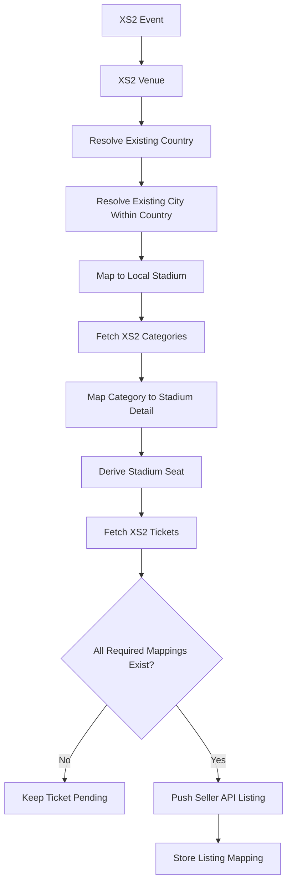
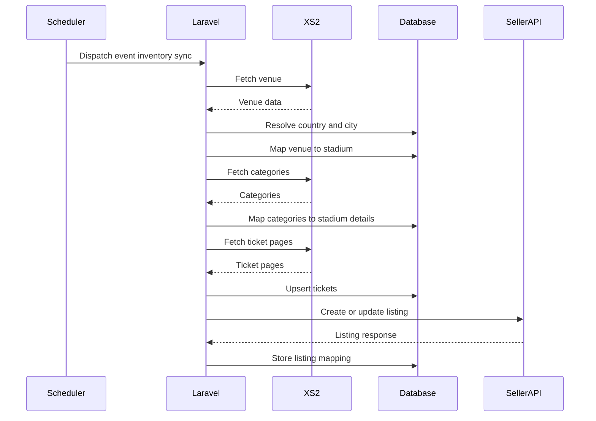

# XS2 inventory mapping

## Local schema and ownership

The XS2 integration reads the existing master catalog and never writes to it.
The discovered production relationships are:

- `countries.id` → `states.country_id` → `cities.state_id`.
- `stadium` (singular) uses `s_id`; its `country` and `city` values point to
  `countries.id` and `cities.id`.
- `stadium_details.stadium_id` points to `stadium.s_id`.
- `stadium_details.category` identifies `stadium_seats.id`; `full_block_name`
  and `block_id` are the available block fields. There is no separate local
  section column in the inspected schema.

Those legacy tables have no database foreign keys and can contain incomplete
references. The integration therefore treats failed joins as pending review,
not as a reason to create or edit master data. In particular, countries,
cities, stadiums, stadium details, and stadium seats are read-only. The three
`XS2_ALLOW_AUTO_CREATE_*` settings are intentionally fixed off by code.

The following new, integration-only tables are created by
`2026_07_29_000000_create_xs2_inventory_mapping_tables.php`:

- `xs2_venues`
- `xs2_stadium_mappings`
- `xs2_category_contexts` (companion data for the existing `xs2_categories`)
- `xs2_category_mappings`
- `xs2_category_mapping_details` (added by
  `2026_07_30_000000_create_xs2_category_mapping_details_table.php`; every
  `stadium_details` row matched to a category mapping — see below, a category
  can match many)
- `xs2_ticket_mapping_states` (companion state for the existing `xs2_tickets`)
- `xs2_event_inventory_sync_states` (companion state for the existing
  `xs2_events`)

`xs2_category_mappings.stadium_detail_id`/`stadium_seat_id` still exist as
columns but are no longer written to — they predate `xs2_category_mapping_details`
and were left in place rather than dropped.

There are deliberately no `xs2_country_mappings` or `xs2_city_mappings`
tables. Country and city resolution is dynamic and the resolved IDs are
audited on `xs2_stadium_mappings` only.

## Mapping process

Country matching tries controlled ISO-like fields (`sortname` in the inspected
catalog, plus any discovered ISO columns) by matching length, then an exact
normalized country name. It never fuzzy-matches a country. City candidates are
limited to cities under the resolved country, including the production
country → state → city hierarchy. This prevents a same-named city in another
country from being selected.

Stadium candidates are limited to the resolved city. Exact/normalized names,
city, country, and optional coordinate proximity are scored and the best five
candidates are stored. A high-confidence result is mapped automatically;
medium-confidence results stay pending for an administrator. Manually
confirmed mappings are never recalculated.

Category candidates are limited to `stadium_details` for the mapped stadium.
When an XS2 `category_name` contains an underscore, the text before its first
underscore ("the requested name") is used for matching; the suffix is treated
as separate section metadata and does not affect the category match. One XS2
category always maps to exactly one seatsbroker category (one
`stadium_seats` entry) — never a swept-in family of several — so matching
tries, in order:

1. **Exact seat-category match**: the requested name equals a
   `stadium_seats.seat_category` name (via `stadium_details.category`),
   normalized. Every `stadium_details` row under that one seat category is
   matched (score 100, auto-maps).
2. **Fuzzy fallback**: if no exact match exists, the requested name is
   fuzzy-matched against individual `full_block_name`/block/section values,
   and the single best-scoring `stadium_details` row (and its one seat
   category) is used. When the category's `category_type` is
   `hospitality`/`offsite_hospitality`, a candidate whose own name/block/section
   text contains a hospitality-indicator word (vip, hospitality, box, suite,
   lounge, premium, club, private) gets an additive ranking bonus
   (`xs2.mapping.category_hospitality_keyword_score`, default 20). This only
   improves which candidate ranks first for admin review — it does not by
   itself guarantee crossing the auto-map or pending thresholds.

If neither step finds anything above the pending confidence threshold, the
mapping is left `unmatched` for an administrator to resolve manually rather
than guessing.

If a resolved match would claim a `stadium_details` row already claimed by a
*different* category mapping at the same stadium, the mapping is forced to
`pending_category_mapping` instead of auto-mapping, so an administrator
resolves the conflict manually rather than the same seats ending up listed
under two different categories.

Every matched `stadium_details` row is stored in `xs2_category_mapping_details`
(one category mapping can have many). XS2 `sub_category` is always retained as
a product/validity variant and is never used as a seating category. Parking,
transport, camping, and extras are marked unsupported and are not published as
ordinary ticket listings.



## Synchronization and publishing

`Xs2EventInventorySyncService` synchronizes one mapped event in this order:
venue, stadium mapping, paginated categories, category mappings, paginated
tickets, ticket mapping status, then queueing listing work. A ticket is only
published when its event, stadium, and stadium-detail mappings are confirmed,
the XS2 event is still future-facing, and its supplier status permits sales.
Cancelled, closed, no-sale, postponed, sold-out, missing, and past events are
reconciled to inactive listings without continuing inventory fetches.
One external XS2 ticket ID produces at most one Seller listing. The mapping
uses the deterministic reference `SELLER_API_EXTERNAL_REFERENCE_PREFIX` plus
the XS2 ticket ID and an idempotency key.

Full synchronizations mark unseen tickets unavailable only after every ticket
page completes successfully. A successful empty full response is authoritative,
so it disables every existing ticket for that event. Incremental synchronizations
never infer that an absent ticket was deleted. Failed, malformed, rate-limited,
or partial XS2 responses never disable active listings.

Publish and disable jobs re-check current mapping/event state when they begin
and share a per-ticket operation lock. This prevents an older queued publish
from reactivating a listing after a newer disable. Removing or ignoring a
category mapping queues reconciliation after commit; later inventory snapshots
also retry the idempotent disable while that mapping remains incomplete.

The Seller client uses the existing Seatsbrokers multipart contract: create,
update, disable, list, and ticket-dropdown endpoints are configured values.
The repository has no Seller API OpenAPI/YAML file, so the optional
`SELLER_API_FIND_LISTING_ENDPOINT` is assumed to accept an
`external_reference` query value and is used only to recover an uncertain
create after a timeout/temporary failure. Confirm that endpoint and response
shape with the Seller API owner before enabling it. Reservation request fields
are likewise undocumented here; `Xs2ReservationService` intentionally sends
no request until guest, hold-expiry, and ticket-selection fields are supplied.



## Configuration

Copy the values in `.env.example`. All external URLs, paths, keys, queue names,
timeouts, retry controls, page limits, mapping thresholds, and money controls
are configuration-backed in `config/xs2.php`, `config/seller-api.php`, and the
legacy-compatible service configuration. Do not commit real keys.

When an enabled client is used without its required base URL, API key, or
endpoint, it raises a descriptive configuration exception. Configuration cache
can still be built before credentials are supplied; validation occurs when an
outbound integration operation is requested.

## Operations

Run the initial setup and workers:

```bash
php artisan migrate --force
php artisan queue:work --queue=xs2-mapping,xs2-sync,seller-api,default --tries=5 --timeout=300
php artisan schedule:work
```

Run synchronization or remapping manually:

```bash
php artisan xs2:sync-inventory --mode=full
php artisan xs2:sync-inventory --mode=incremental
php artisan xs2:sync-inventory --mapping-id=456 --force
php artisan xs2:sync-inventory --event-id=external-event-id
php artisan xs2:backfill-venues --dry-run
php artisan xs2:backfill-venues
php artisan xs2:resolve-stadiums
php artisan xs2:resolve-stadiums --venue-id=external-venue-id --force
php artisan xs2:resolve-categories
php artisan xs2:resolve-categories --stadium-id=123
php artisan test
```

Use `xs2:backfill-venues` after deploying a venue-normalization repair: it
rebuilds venue records from stored event data and never calls XS2. Follow it
with `xs2:resolve-stadiums` and `xs2:resolve-categories`.

The scheduler runs incremental inventory work every five minutes and full work
hourly. The incremental run skips the top of the hour so the full run has
priority. Jobs share a per-event cache lock, and XS2 calls are paced globally
by `XS2_RATE_LIMIT_PER_MINUTE`; the command staggers inventory jobs using
`XS2_INVENTORY_DISPATCH_INTERVAL_SECONDS` (four seconds by default at 30 RPM).

## Admin endpoints

All endpoints are internal and use the existing `auth:sanctum` plus `admin`
middleware:

- `GET /api/admin/xs2/stadium-mappings`
- `GET /api/admin/xs2/stadium-mappings/{mapping}/stadium-options`
- `POST /api/admin/xs2/stadium-mappings/{mapping}/confirm|change|ignore`
- `GET /api/admin/xs2/category-mappings`
- `GET /api/admin/xs2/category-mappings/{mapping}/category-options`
- `POST /api/admin/xs2/category-mappings/{mapping}/confirm|change|ignore`
- `POST /api/admin/xs2/events/{mapping}/sync`
- `GET /api/admin/xs2/events/{mapping}/sync-status`
- `GET /api/admin/xs2/events/{mapping}/tickets` (supports `push_status=pending|processing|synced|failed`)
- `GET /api/admin/xs2/tickets` (cross-event listing; supports `mapping_status`, `push_status=pending|processing|synced|failed`, and `search` matching category name, event name, venue name, or city; each row includes an `event` object with `mapping_id`/`name`/`venue_name`/`city`/`starts_at`)
- `GET /api/admin/xs2/tickets/{ticket}` (single-ticket detail; adds `sub_category`, `ticket_title`, `category_type` (resolved from the ticket's category context), `net_rate`/`face_value` (converted from stored minor units to major units using `XS2_CURRENCY_MINOR_UNIT_DIVISOR`), `ticket_valid_from`/`ticket_valid_until`, `flags`/`options`/`sales_periods`, `external_created_at`/`external_updated_at`, and the stored `raw_payload` on top of the list shape)
- `POST /api/admin/xs2/tickets/{ticket}/retry-listing|disable-listing|delete-listing` (append `?sync=1` to run the Seller API job inline and return `data.seller_response`, `data.seller_api_debug` (sanitized HTTP trace: URL, headers, bodies), `sync_status`, and related fields in the JSON body; without it the action returns `202` with `data.queued: true`)

The ticket list response includes `push_status`, `push_error`, and
`last_pushed_at`, so the admin frontend can poll the same endpoint after a
sync or retry. `push_status` moves from `pending` to `processing`, then to
`synced` or `failed`. Failed-push errors are intentionally sanitized; use the
application logs for the upstream error details.

Confirming a stadium or category mapping re-evaluates pending tickets. Category
mapping confirm/remove/ignore runs that reconciliation synchronously so listing
status updates before the admin response returns; stadium mapping still queues
on `xs2-mapping` (ahead of inventory sync).
Missing countries, states, cities, stadiums, details, or seats must be created
by an administrator in the existing master-data interface first, then the
relevant mapping command can be re-run.

### Frontend review flow

The mapping-review UI must resolve a pending venue before showing its category
picker. Fetch pending venues with
`GET /api/admin/xs2/stadium-mappings?status=pending_stadium_mapping`, then
load its safe local choices from
`GET /api/admin/xs2/stadium-mappings/{mapping}/stadium-options`. Choices are
restricted to the resolved city; an empty response with
`meta.selection_available: false` means city resolution must be fixed first.
Confirm the selected option with `POST .../{mapping}/confirm` and
`{ "stadium_id": 123 }`.

After the venue is mapped, fetch categories with
`GET /api/admin/xs2/category-mappings?status=pending_category_mapping&stadium_id=123`.
For an XS2 category name such as `Longside_Section A`, the category-mapping
response exposes `category.name` as `Longside`, `category.section` as
`Section A`, and retains the original value as `category.raw_name`. One XS2
category always resolves to exactly one seatsbroker category (see Mapping
process above), which can still span several physical `stadium_details` rows
(blocks/sections) under that one category; the response exposes them as a
`details` array
(`stadium_detail_id`/`stadium_seat_id`/`block`/`section`/`name`/`stadium_seat_name`
per entry) and a `details_count`. The `index` listing only returns
`details_count` (a category can resolve to hundreds of details); fetch
`GET .../{mapping}` for the full `details` array.

Load the dropdown from
`GET /api/admin/xs2/category-mappings/{mapping}/category-options` — one row
per seatsbroker category (`stadium_seat_id`/`stadium_seat_name`/`detail_count`)
for the mapped stadium, rather than a raw block/section list. Confirm with
`POST .../{mapping}/confirm`:

- **No body** confirms the currently auto-resolved `details` set as-is (409/422
  if that set is empty — there is nothing to confirm).
- `{ "stadium_seat_id": 335 }` replaces the set with every `stadium_details`
  row under that one seatsbroker category; the ID must belong to the mapped
  stadium or the request is rejected with a validation error on
  `stadium_seat_id`.

`POST .../{mapping}/change` behaves the same way but requires `stadium_seat_id`
to be present (it has no "confirm as-is" mode). The category-options endpoint
returns `409` until the parent stadium mapping is confirmed.

## Checkout and troubleshooting

Call `Xs2CheckoutValidationService` before a hold or order. It fetches the
latest ticket and returns stable reason codes for unavailable, insufficient,
price/currency-changed, invalid-quantity, expired, package, and temporary XS2
failures. It never silently accepts a changed price.

If listings remain pending, inspect the mapping status in the admin endpoint:
`pending_event_mapping`, `pending_stadium_mapping`,
`pending_category_mapping`, and `unsupported_category` deliberately block
publication. Check that workers consume both queues, confirm that the configured
page/rate limits fit the provider account, and review structured application
logs. Logs deliberately exclude API keys, authorization headers, raw customer
data, and payment information.
