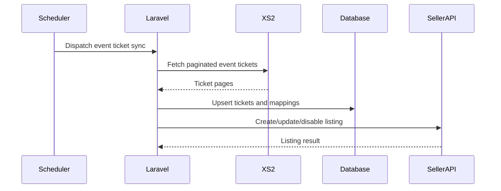

# XS2 ticket synchronization

Mapped `EventMapping` records queue an event-scoped ticket synchronization. Full syncs fetch all ticket rows for the event (`event_id`, youth included), upsert normalized `xs2_tickets`, and only after successful completion mark unseen inventory unavailable. A successful empty full snapshot disables all existing inventory for the event; malformed, partial, or failed pagination is never treated as authoritative. Incremental syncs use the configured overlap and never reconcile absent records. Their `updated` filter is sent as a UTC date (`ge:YYYY-MM-DD`); this is the compatible filter form for the XS2 tickets endpoint. Changed tickets queue a single Seller API listing operation only when event, stadium, and category/section mappings are complete (`ready_to_publish`) and the ticket is available with stock; otherwise inventory is stored locally and any existing Seller listing is disabled. Creates include the stable ticket-and-local-event `seller_reference` and an `Idempotency-Key` header; a create is only marked synced when the Seller API returns a listing ID. Mapping, remapping, ignoring, and reopening queue a post-commit listing reconciliation so obsolete listings are disabled. Past or supplier-unavailable events are reconciled instead of fetched, and every queued publish revalidates current event and mapping state before writing to Seller API.

Scheduled `xs2:sync-inventory` queues ticket fetches for every upcoming sellable XS2 event, including rows still pending local event, venue, or category mapping. Seller API pushes remain gated on complete mappings.

Configure every `XS2_*` and `SELLER_API_*` variable in `.env.example`, including `SELLER_API_SELLER_ID` and `SELLER_API_LISTING_BASE_URL` (seller multipart host, not `externalapi`). Then run `php artisan migrate`, `php artisan queue:work --queue=xs2-mapping,xs2-sync,seller-api,default`, `php artisan schedule:work`, and `php artisan xs2:sync-tickets --mode=full`. The Seller API uses multipart form requests at `/api/ticket/create`, `/api/ticket/edit`, `/api/ticket/update_status`, and `/api/ticket_dropdown` on the **listing** host (`https://sellerapi.seatsbrokers.com` in production). Ticket categories, types, and split types are resolved per match through the dropdown endpoint before listings are created or updated. Reservation creation is intentionally not sent because its request schema is not documented here.

Checkout callers can use `Xs2CheckoutValidationService::validate()` to fetch the current ticket and reject changed price, currency, stock, validity, or quantity rules.

## Seller API listing price fields

`PushXs2TicketToSellerApi` builds the multipart create/edit body through `Xs2SellerListingTransformer`. Amounts are taken from XS2 ticket rows already stored in **minor units** (cents for EUR; see `XS2_CURRENCY_MINOR_UNIT_DIVISOR`, default `100`). By default (`SELLER_API_PRICE_USES_MINOR_UNITS=false`), `price` and `facevalue` are sent as **major-unit decimals** matching the Seatsbrokers External Seller API contract (for example admin net rate €118 → `price=118.00`). Set `SELLER_API_PRICE_USES_MINOR_UNITS=true` only if your listing host expects raw minor integers unchanged.

| Seller API field | XS2 source | Meaning |
| --- | --- | --- |
| `price_type` | `xs2_tickets.currency_code` | Listing currency (for example `EUR`). |
| `price` | `xs2_tickets.net_rate`, else `face_value` | Sell price shown in admin as **net rate**; must match the synced XS2 net rate, not a local markup. |
| `facevalue` | `xs2_tickets.face_value`, else `net_rate` | Printed/nominal ticket face value from XS2. |

Admin JSON exposes `net_rate` and `face_value` as major units for display; the transformer uses the stored minor-unit columns when publishing.

429/503/5xx requests retry with configured backoff. A failed XS2 fetch cannot reconcile or disable unseen tickets. Use `php artisan test` for automated verification.
